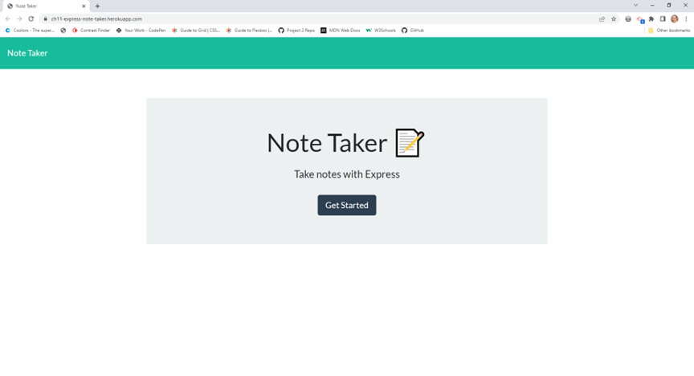
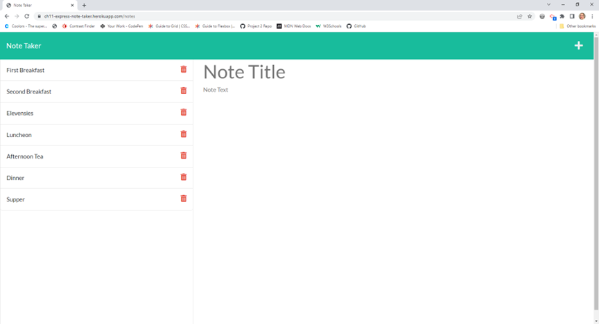

# Challenge 11 Note Taker - 

## DESCRIPTION

This is a note taker app that can write and save notes. It uses Express.js on the backend and saves and retrieves note data from a JSON file. 
Link to application: https://ch11-express-note-taker.herokuapp.com/   

## TABLE OF CONTENTS

1. [Usage](#usage)
2. [Installation](#installation)
3. [Preview Images](#Preview)
4. [Contributing](#contributing)
5. [Tests](#tests)
6. [Questions](#questions)

## USAGE

There is none

## INSTALLATION

No installation needed. This is an online app deployed with Heroku
PLease click this link: https://ch11-express-note-taker.herokuapp.com/

## PREVIEW

Images: 

## CONTRIBUTING

Use Contributor Convenant

## TESTS

There are no tests for this sinple application

## QUESTIONS

For questions: 
Github profile: [sewprano](https://github/com/sewprano)

